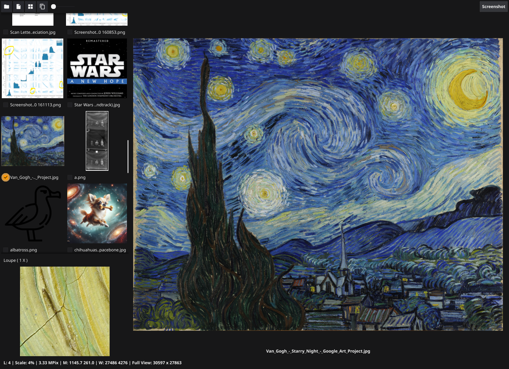
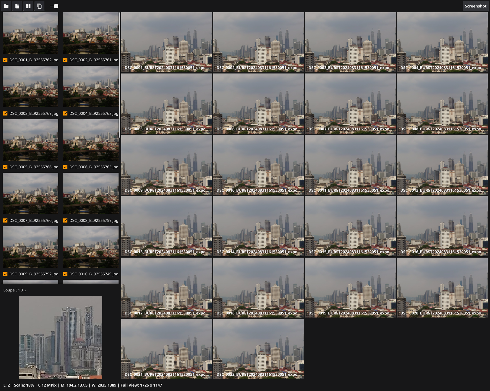

# Some Widgets

Because large images can take time to render on a device, especially when the image has more pixels than the display device, it makes sense to display an image with as few pixels as possible.

These widgets approach this by using multiple images of varying resolution.

## PanZoomCanvas Widget

This widget contains a Gaussian pyramid of lower-resolution images. For very large images, this allows the user to zoom in and out more smoothly and quickly. The pyramid handling is automatic.

The mouse wheel can be used to zoom in and out smoothly, in adjustable increments. Panning is achieved by zooming out at one position, and zooming in at another.

Additionally, the widget provides a small window at full-resolution that tracks the mouse, which can be used as a loupe.

Below is a screen grab - there is a thumbnail at top left, and a loupe at bottom left. Selected images are shown in the grid on the right. Zooming or manning one image does the same to all images.

Below is a single image being viewed. The image itself is over 700 megapixels. It takes a long time to load and rasterise. At 100% scaling, cracks in the paint are visible. Zooming with the mouse from very large to very small is smooth, but see the Limitations below.

#### Memory Requirements 
memory usage for the pyramid is around 1.5 times that of the underlying image.Image, including the full-resolution image, assuming size * ( 1 + 1/4 + 1/16 + ... )

## Thumbnail Widgets

Can be used to generate a thumbnail in a specified rectangle (which it will compeltely fill)

There is also a thumbnail grid widget, as it is useful to display groups of thumbnails together.

## StatusProgressWidget Widget - combined Status Bar & Progress Bar with Widget Communication ##

These are combined, and generally live at the bottom of an application. A channel is used for communication. This channel is provided to widget constructors, so they can send messages to the application. 

- If a string is received, it is placed on the status bar. 
- If a float between 0 and 1 is received, it sets the progress bar
- If a float between -1 and 0 is received, it increments the progress bar (eg, -0.1 will add 0.1 or 10% to the progress value). This helps with concurrent progress, as increments can be made when a goroutine completes.
- If a large float is received, the indeterminite or infinite progress bar turns on or off (positive for on, negative for off)
- If a Message type is received, the text portion is displayed for the duration portion, then cleared.

## Loupe Widget ##

This can be used as a magnifying glass when looking at a large image on screen. It shows a small portion of the image at full scale. The size of the loupe is specified in the constructor, but can also be scaled (by 100%, 200% or 300%) to ensure that every pixel can be seen well.

# Minimal Fyne Implementation

The cmd/ folder includes an app that shows the widgets.

`go run .\cmd\` on Windows shows the main image, a grid and a loupe. The buttons:
1. Open a folder and show selectable thumbnails - click on an image to display it in the main window to the right.
2. Open a single image from the file system
3. Create a grid of images from those that have been selected in the thumbnails
4. Toggle selecting all or none of the thumbnails
5. The slider can be used to vary the number of columns in the grid dynamicaly (it has a bug...I am looking into it...)

Use the mouse on any image in the main window to scroll in and out at the mouse location. Right click to show the full image again. Drag with the left mouse button to drag the image around the screen. These alter the datum that defines the relationship between image and device pixels.

Moving the mouse displays some information in the status bar below.

If there is more than one image in the main window, then the zoom and pan behaviour applied to any of them is applied to all of them (they use a shared datum).

In the main window, 

# Limitations #

The widgets are designed to be displayed in groups, generally in a grid. Displaying a single image full-screen suffers from slower performance, for the same reason that normal images are slow to display, viz too many pixels are being pushed to the graphics card.

In the demonstration application, try opening a folder of digital camera pictures (JPEG), say around 30. Then select all of them (button at the top) and tap the grid button. All image files will be opened in parallel and they will appear on a grid in the centre of the screen.

Paradoxically, this is generally quicker than panning or zooming a single large image, as images are recalculated for display in parallel.

For example, 22 images of 12 megapixels are relatively easy to zoom and pan.

